# Aplikasi TodoList (Java, Console-Based)

Aplikasi TodoList ini adalah proyek berbasis Java yang dikembangkan untuk menerapkan konsep Pemrograman Berorientasi Objek (PBO). Program berjalan melalui console dan menyediakan fitur CRUD lengkap untuk mengelola daftar tugas. Struktur program dibagi menjadi tiga file utama: `Task.java`, `TodoListManager.java`, dan `Main.java`.

## Deskripsi Singkat

Aplikasi ini memungkinkan pengguna untuk:

* Menambahkan task baru
* Melihat seluruh task yang tersimpan
* Mengubah nama task atau mengubah statusnya (selesai/belum)
* Menghapus task dengan konfirmasi
* Menutup aplikasi dengan aman

Setiap fitur dibangun menggunakan pendekatan OOP yang terstruktur, dengan pembagian class berdasarkan Model, Logic Manager, dan UI Controller.

## Struktur Kode

### **1. Task.java (Model)**

File ini berfungsi sebagai representasi objek task.
Berisi atribut `id`, `nama`, dan `selesai`, lengkap dengan constructor, getter/setter, dan override `toString()` untuk tampilan yang lebih rapi.

### **2. TodoListManager.java (Logic)**

Berperan sebagai pusat operasi CRUD:

* Menyimpan seluruh task di dalam `ArrayList`
* Fitur tambah, lihat, update, toggle status, dan hapus task
* Memiliki helper method untuk mencari task berdasarkan ID

### **3. Main.java (User Interface)**

Mengatur alur utama aplikasi:

* Menampilkan menu
* Mengelola input user
* Menghubungkan UI ke `TodoListManager`
* Menyediakan fitur tambahan seperti multiple add dan validasi input

## Fitur Utama

* **Tambah Task** (support multiple add)
* **Lihat Semua Task** dengan format `[✓]` atau `[ ]`
* **Update Task** (edit nama atau toggle status)
* **Hapus Task** dengan konfirmasi keamanan
* **Input Validation** dan error handling untuk mencegah crash
* **Menu Console** dengan tampilan yang rapi (Unicode border)

## Flowchart Sistem Lengkap

```mermaid
flowchart TD
    Start([🚀 START PROGRAM]) --> Init[Initialize Scanner & TodoListManager]
    Init --> SetRun[Set running = true]
    SetRun --> MainLoop{running == true?}
    
    %% Main Menu Loop
    MainLoop -->|Yes| Menu[📋 Tampilkan Menu Utama]
    Menu --> Input[⌨️ Input Pilihan 1-5]
    Input --> TryCatch{Input Valid?}
    TryCatch -->|No| Invalid[pilihan = -1]
    TryCatch -->|Yes| Valid[pilihan = user input]
    Invalid --> Switch
    Valid --> Switch
    
    %% Switch Case Menu
    Switch{Switch pilihan}
    Switch -->|1| Add
    Switch -->|2| View
    Switch -->|3| Update
    Switch -->|4| Delete
    Switch -->|5| ExitChoice[Set running = false]
    Switch -->|default| ErrorMsg[❌ Pilihan tidak valid]
    
    %% ========== MENU 1: TAMBAH TASK ==========
    Add[➕ MENU TAMBAH TASK] --> AddLoop[tambahLagi = true]
    AddLoop --> AddCheck{tambahLagi?}
    AddCheck -->|Yes| AddPrompt[📝 Input nama task]
    AddPrompt --> AddEmpty{nama kosong?}
    
    AddEmpty -->|No| CallAdd[🔹 manager.tambahTask nama]
    CallAdd --> AddSuccess[✅ Task ditambahkan<br/>ID: nextId++]
    AddSuccess --> AskMore[Tambah lagi? y/n]
    AskMore --> MoreAnswer{jawaban == y?}
    MoreAnswer -->|Yes| AddCheck
    MoreAnswer -->|No| AddDone[✅ Selesai menambah!]
    AddDone --> BackMain1
    
    AddEmpty -->|Yes| AddError[❌ Nama tidak boleh kosong<br/>💡 Tips: Input nama jelas]
    AddError --> AskRetry[Coba lagi? y/n]
    AskRetry --> RetryAnswer{jawaban == y?}
    RetryAnswer -->|Yes| AddCheck
    RetryAnswer -->|No| BackMain1
    AddCheck -->|No| BackMain1[↩️ Return to Main Loop]
    
    %% ========== MENU 2: LIHAT TASK ==========
    View[📋 MENU LIHAT TASK] --> ViewEmpty{taskList.isEmpty?}
    ViewEmpty -->|Yes| ViewError[📭 Belum ada task]
    ViewError --> BackMain2
    
    ViewEmpty -->|No| ViewHeader[Print: === DAFTAR TASK ===]
    ViewHeader --> ViewLoop[For each task in taskList]
    ViewLoop --> ViewPrint[Print: task.toString<br/> ex: ✓ 1. Belajar Java]
    ViewPrint --> ViewNext{Ada task lagi?}
    ViewNext -->|Yes| ViewLoop
    ViewNext -->|No| BackMain2[↩️ Return to Main Loop]
    
    %% ========== MENU 3: UPDATE TASK ==========
    Update[✏️ MENU UPDATE TASK] --> UpdateShow[📋 Tampilkan semua task]
    UpdateShow --> UpdateInput[🔢 Input ID 0=batal]
    UpdateInput --> UpdateZero{ID == 0?}
    
    UpdateZero -->|Yes| UpdateCancel1[↩️ Update dibatalkan]
    UpdateCancel1 --> BackMain3
    
    UpdateZero -->|No| UpdateNeg{ID < 0?}
    UpdateNeg -->|Yes| UpdateError1[❌ ID tidak valid]
    UpdateError1 --> BackMain3
    
    UpdateNeg -->|No| UpdateMenu[📝 Pilih aksi:<br/>1. Edit nama<br/>2. Toggle status]
    UpdateMenu --> UpdateAction[⌨️ Input pilihan]
    UpdateAction --> ActionSwitch{Pilihan?}
    
    ActionSwitch -->|1| EditName[✏️ Input nama baru]
    EditName --> EditEmpty{nama kosong?}
    EditEmpty -->|Yes| EditError[❌ Nama tidak boleh kosong]
    EditError --> BackMain3
    EditEmpty -->|No| CallEdit[🔹 manager.updateTask id, nama]
    CallEdit --> EditSuccess[✅ Task diupdate]
    EditSuccess --> BackMain3
    
    ActionSwitch -->|2| CallToggle[🔹 manager.toggleStatusTask id]
    CallToggle --> ToggleFind[🔍 Cari task by ID]
    ToggleFind --> ToggleCheck{task != null?}
    ToggleCheck -->|Yes| ToggleStatus[task.setSelesai !selesai]
    ToggleStatus --> ToggleMsg[✅ Status berubah:<br/>Selesai / Belum Selesai]
    ToggleMsg --> BackMain3
    ToggleCheck -->|No| ToggleError[❌ Task tidak ditemukan]
    ToggleError --> BackMain3
    
    ActionSwitch -->|other| UpdateError2[❌ Pilihan tidak valid]
    UpdateError2 --> BackMain3[↩️ Return to Main Loop]
    
    %% ========== MENU 4: HAPUS TASK ==========
    Delete[🗑️ MENU HAPUS TASK] --> DeleteShow[📋 Tampilkan semua task]
    DeleteShow --> DeleteInput[🔢 Input ID 0=batal]
    DeleteInput --> DeleteZero{ID == 0?}
    
    DeleteZero -->|Yes| DeleteCancel1[↩️ Penghapusan dibatalkan]
    DeleteCancel1 --> BackMain4
    
    DeleteZero -->|No| DeleteNeg{ID < 0?}
    DeleteNeg -->|Yes| DeleteError[❌ ID tidak valid]
    DeleteError --> BackMain4
    
    DeleteNeg -->|No| Confirm[⚠️ Yakin hapus ID? y/n]
    Confirm --> ConfirmInput[⌨️ Input konfirmasi]
    ConfirmInput --> ConfirmCheck{konfirmasi == y?}
    
    ConfirmCheck -->|Yes| CallDelete[🔹 manager.hapusTask id]
    CallDelete --> DeleteFind[🔍 Cari task by ID]
    DeleteFind --> DeleteFound{task != null?}
    DeleteFound -->|Yes| DoDelete[taskList.remove task]
    DoDelete --> DeleteSuccess[✅ Task berhasil dihapus]
    DeleteSuccess --> BackMain4
    DeleteFound -->|No| DeleteNotFound[❌ Task tidak ditemukan]
    DeleteNotFound --> BackMain4
    
    ConfirmCheck -->|No| DeleteCancel2[↩️ Penghapusan dibatalkan]
    DeleteCancel2 --> BackMain4[↩️ Return to Main Loop]
    
    %% ========== BACK TO MAIN LOOP ==========
    BackMain1 --> CheckStillRun
    BackMain2 --> CheckStillRun
    BackMain3 --> CheckStillRun
    BackMain4 --> CheckStillRun
    ErrorMsg --> CheckStillRun
    
    CheckStillRun{running?}
    CheckStillRun -->|Yes| Pause[⏸️ Tekan Enter untuk lanjut...]
    Pause --> MainLoop
    
    %% ========== EXIT PROGRAM ==========
    ExitChoice --> ExitMsg[👋 Terima kasih telah<br/>menggunakan TodoList!]
    ExitMsg --> CheckStillRun
    CheckStillRun -->|No| CloseScanner[🔒 Close Scanner]
    CloseScanner --> End([🏁 END PROGRAM])
    
    %% ========== STYLING ==========
    style Start fill:#90EE90,stroke:#006400,stroke-width:3px
    style End fill:#FF6B6B,stroke:#8B0000,stroke-width:3px
    style Add fill:#87CEEB,stroke:#00008B,stroke-width:2px
    style View fill:#87CEEB,stroke:#00008B,stroke-width:2px
    style Update fill:#87CEEB,stroke:#00008B,stroke-width:2px
    style Delete fill:#87CEEB,stroke:#00008B,stroke-width:2px
    style Menu fill:#DDA0DD,stroke:#8B008B,stroke-width:2px
    style Switch fill:#FFD700,stroke:#FF8C00,stroke-width:2px
    style MainLoop fill:#FFD700,stroke:#FF8C00,stroke-width:2px
    style TryCatch fill:#FFD700,stroke:#FF8C00,stroke-width:2px
    style AddEmpty fill:#FFD700,stroke:#FF8C00,stroke-width:2px
    style ViewEmpty fill:#FFD700,stroke:#FF8C00,stroke-width:2px
    style UpdateZero fill:#FFD700,stroke:#FF8C00,stroke-width:2px
    style DeleteZero fill:#FFD700,stroke:#FF8C00,stroke-width:2px
    style ConfirmCheck fill:#FFD700,stroke:#FF8C00,stroke-width:2px
```



### **Keterangan Flowchart:**

| Simbol | Warna | Keterangan |
|--------|-------|------------|
| 🟢 Hijau | Start/End | Awal dan akhir program |
| 🔵 Biru | Menu Fitur | 4 menu utama (Tambah, Lihat, Update, Hapus) |
| 🟡 Kuning | Decision | Kondisi/percabangan (if, while, switch) |
| 🟣 Ungu | Main Menu | Tampilan menu utama |
| 🔴 Merah | End | Program selesai |

### **Alur Sistem:**
1. **START** → Initialize Scanner & TodoListManager
2. **Main Loop** → While running == true
3. **Menu** → Tampilkan 5 pilihan
4. **Switch** → Pilih menu (1-5)
5. **Execute** → Jalankan fitur sesuai pilihan
6. **Pause** → Tunggu Enter untuk lanjut
7. **Loop Back** → Kembali ke menu utama
8. **Exit** → Jika pilih 5, keluar program
9. **END** → Close scanner & program selesai

### **Class Diagram**


## Testing

Seluruh fitur diuji melalui berbagai skenario:

* Input valid dan invalid
* List kosong maupun berisi
* Update dan toggle status
* Penghapusan dengan konfirmasi
* Penanganan input huruf pada field angka

Hasil: **10/10 test cases lulus** tanpa error.

## Konsep OOP yang Diterapkan

* **Encapsulation** — atribut private, akses via getter/setter
* **Class & Object Construction** — pemisahan model, logic, dan UI
* **Method Overriding** (`toString()`)
* **Collection Framework (ArrayList)**
* **Error Handling** (try–catch dan null checking)

## Struktur Proyek

```
todolist/
│
├── src/
│   ├── Task.java
│   ├── TodoListManager.java
│   └── Main.java
│
├── bin/                  (hasil compile)
└── README.md             (file ini)
```

## Cara Menjalankan

### Compile:
```bash
cd todolist/src
javac *.java
```

### Run:
```bash
java Main
```

### Atau menggunakan VS Code:
1. Buka folder `todolist` di VS Code
2. Klik kanan pada `Main.java`
3. Pilih "Run Java"

## Screenshot Program

### Menu Utama
```
╔════════════════════════════════╗
║     APLIKASI TO DO LIST         ║
╚════════════════════════════════╝
1. Tambah Task
2. Lihat Semua Task
3. Update/Edit Task
4. Hapus Task
5. Keluar

Pilih menu (1-5):
```

### Contoh Output Lihat Task
```
=== DAFTAR TASK ===
[ ] 1. Belajar Java
[✓] 2. Ngerjain Tugas PBO
[ ] 3. Baca Buku OOP
```

## Kontributor

Proyek ini dikerjakan oleh tim beranggotakan lima orang, dengan pembagian tugas mulai dari pembuatan model, fitur CRUD, menu UI, hingga dokumentasi teknis.

### Pembagian Tugas:
- **Person 1**: Task.java (Model)
- **Person 2A-2D**: TodoListManager.java (4 sections)
- **Person 3**: Main method & Menu utilities
- **Person 4**: Feature Add Task
- **Person 5**: Feature Update & Delete Task

## Status Proyek

**✅ Selesai • ✅ Stabil • ✅ Siap Digunakan**

---

Made with ❤️ by Team TodoList
